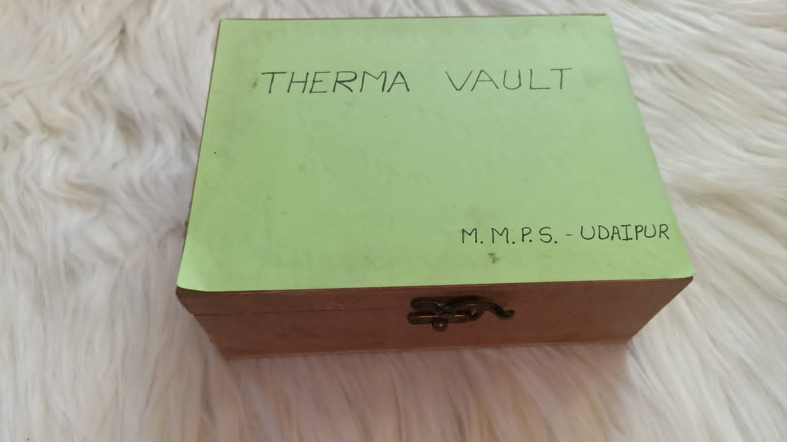
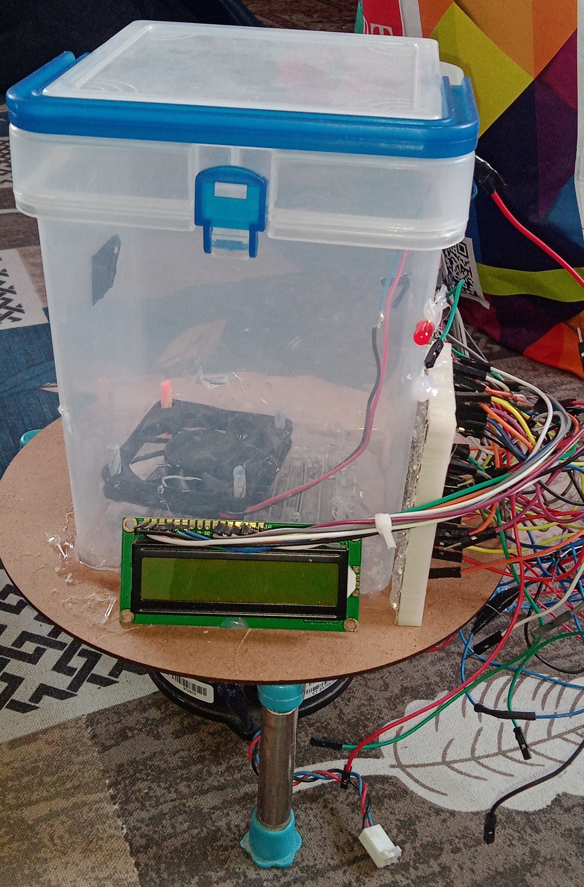
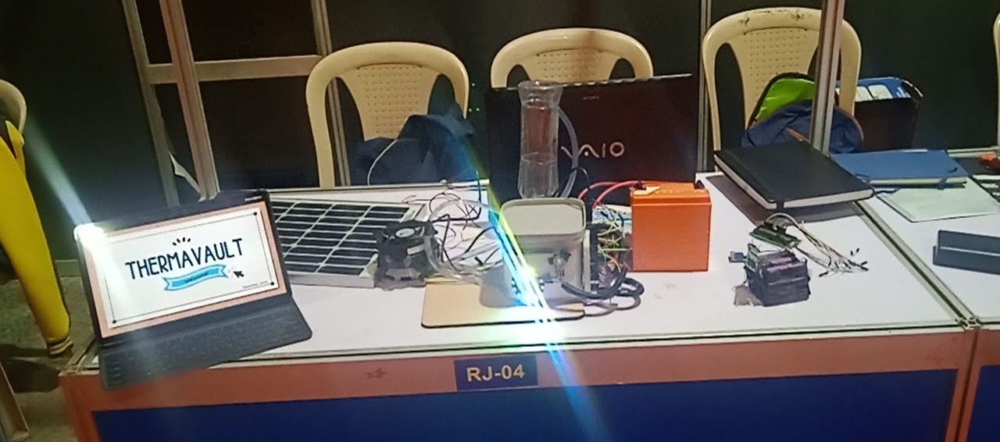

# ThermaVault
**A Peltier powered "Coolbox" designed to keep Medicines and other Perishables... well, Cool!**

**STATUS: Prototype (v0.8)**

_**Backstory:**_ I originally heard about a device named 'The Thermoelectric Cooler (Peltier device)' on ElectroBOOM's channel, and i found the concept so fascinating that i just had to go ahead and buy one for myself.
Eventually, once i had gone down it's rabbit hole enough (Which also included overvolting a Peltier Device, which led to it committing Sudoku), I decided to let my intrusive thoughts win over and make an actual Physical Project based on it and named it ThermaVault!
Somehow (I still can't believe it), ThermaVault ended up making it to a National level Science Model competition!
I later decided to make it my Final Year School project aswell, Whose document you can find in this repository named as 'Pumping Heat like Water.pdf'

----
## Evolution of ThermaVault

**ThermaVault v0.1,**
Basically just a proof of concept, bare-bones Peltier Module hooked up to a Car battery

**ThermaVault v0.4,**
The first Arduino Controlled Prototype with an LCD Display and a Basic Fan cooling system

**ThermaVault v0.8,**
The latest iteration on display at the National Level of Western India Science Fair - 2025.
Featuring Wireless monitoring, Better Arduino control with Power saving modes, and a Water-based cooling system

## Current Features
- Able to maintain a certain user set Temperature in it's internal Volume
- Features a custom-built Water cooling system for a TEC1-12706 (4cm * 4cm Peltier Module)
- Can run on Battery Backup charged using a Solar Panel (Not completely off-grid yet)
- Features a Mobile app capable of sending Serial Commands over Bluetooth to control the Vault
- Uses a "Hibernation" mode to conserve power when Internal Temperature < User set Temperature
- Can also be controlled using a Physical Potentiometer and an RGB-LED array to view the set Parameters

## Planned Improvements for ThermaVault
1. [ ] Collect Long Term operational Data and infer further flaws with the current system
2. [ ] Make it completely reliant on Solar Power
3. [ ] Improve the Cooling system
4. [ ] Make the internal Volume larger
5. [ ] Introduce a larger and more efficient Peltier Cooling module
6. [ ] Minimize Thermal leakage from the environment
(More to come...)

## Specifications
- Cooling Systems: TEC1-12706 (4cm * 4cm Peltier Module), Water/Radiator Based cooling system
- Power Systems: 20W Solar Panel, 12v Lead-Acid Battery, Solar Charge Controller
- Compute Systems: Arduino UNO R3
- Temperature Sensors: DHT11, DS18B20 and NTC Thermistors
- Control Interfaces:
    - HC-05 Bluetooth Module + ThermaVault Application
    - USB Serial Communication
    - Physical Potentiometer + WS2812 LED Array
- Power Switching: 2 Mechanical Relays
  
## License
This project is licensed under the MIT License. I would be honoured to receive any Suggestions/Improvements for the Project :)

**Made with love by Yours Truly!**
_**Thanks a ton for your time! :D**_
